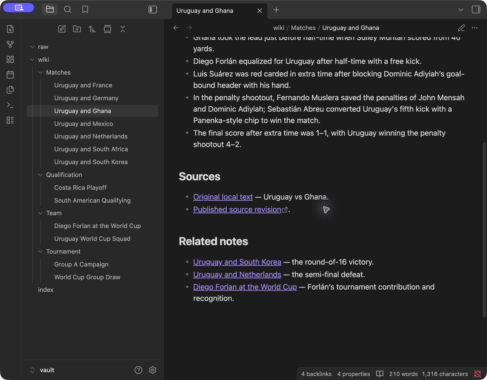
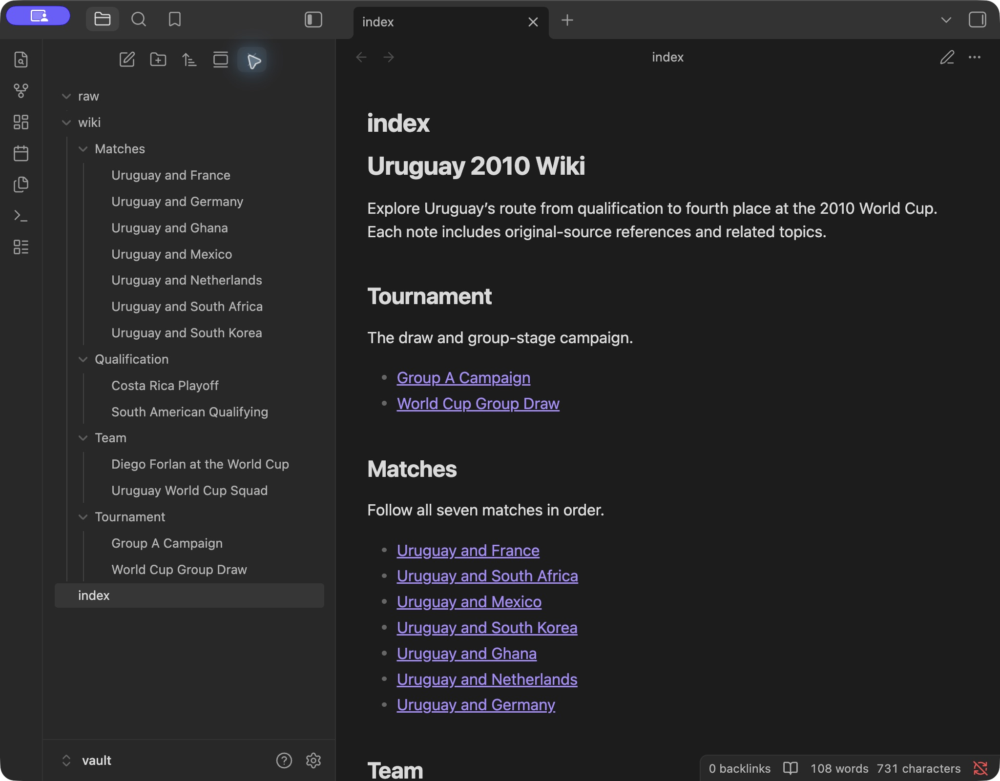
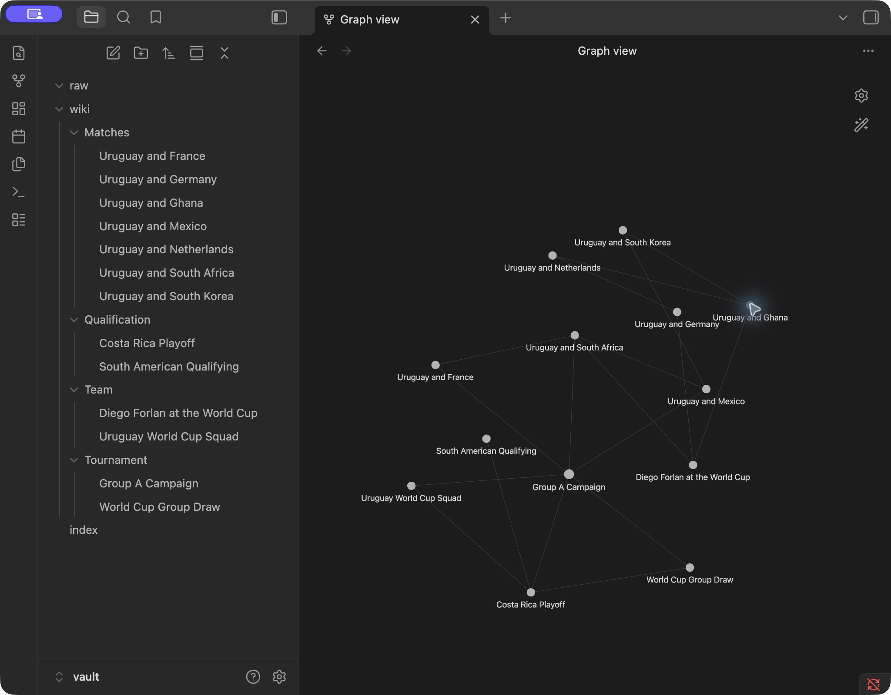

# Celeste — Uruguay 2010 Personal Wiki

Celeste is an English-language personal wiki about Uruguay’s route to fourth place at the 2010 World Cup. It uses local Gemma through Ollama, a small Python CLI, original-source retrieval, and linked Markdown notes in Obsidian. Read [START_HERE.md](START_HERE.md) for a guided walkthrough.

**Submission status:** Local CLI, sources, reviewed wiki notes, model tests, and Obsidian screenshots are included. The disconnected offline demonstration is still pending. Later updates will use this same repository URL.

## Start here: rubric and evidence

This table maps the assignment’s three grading categories to the submitted artifacts. Status labels describe observed work; they are not predicted scores.

| Rubric category | What to inspect | Current status |
|---|---|---|
| Deliverable quality — 4 points | [CLI and harness](wiki.py), [retrieval](retrieval.py), [local model client](local_model.py), [separate prompts](prompts/), [wiki index](vault/index.md), [topic folders](vault/wiki/), [sources and attribution](research/Sources%20and%20Licenses.md), setup below | Implemented; 13 notes reviewed against sources; screenshots below |
| Testing and evaluation — 3 points | Four evidence cards below, [predefined expectations](evaluation/questions.json), [chat checks](evidence/evaluation-20260930T055946/chat-transcript.txt), [search output](evidence/search-with-model-unloaded.json), [chat/ask separation](evidence/evaluation-20260930T055946/chat-isolation-ask.txt), [failures and fixes](evidence/Validation.md) | Connected local tests reviewed; disconnected repetition pending |
| Working result — 3 points | [Actual Gemma ingestion](evidence/runs/20260930T060256-ingest-summary-53e3dd.md), [unchanged re-ingestion](evidence/idempotent-ingestion.json), [runtime identity](evidence/model-identity.json), [offline demonstration page](evidence/offline/README.md) | Local operation demonstrated; mandatory offline proof pending |

### Four research questions: actual answers and source review

Each readable card includes the actual question, answer, retrieved original passages and paths, exact model digest, measured call data, and an assessment of whether the source supports the material claims. Full machine-readable traces sit alongside the cards. These are **local connected runs**, not offline evidence.

| Test | Question | Answer, passages, and assessment |
|---|---|---|
| ask-01 | What were Uruguay’s results in the group stage of the 2010 World Cup, and how many points did they finish with? | [Readable evidence card](evidence/runs/20260930T060024-ask-e61788.md) |
| ask-02 | How was Uruguay’s match against Ghana decided, and what did Muslera and Abreu do? | [Readable evidence card](evidence/runs/20260930T060212-ask-e0d205.md) |
| ask-03 | Who did Uruguay play after the quarter-finals, and where did they finish? | [Readable evidence card](evidence/runs/20260930T060436-ask-556a03.md) |
| ask-04 | What did Diego Forlán eat for breakfast on the day Uruguay played Ghana in the 2010 World Cup? | [Readable evidence card](evidence/runs/20260930T060310-ask-12c3dd.md) |

### Wiki in Obsidian

The screenshots show the actual vault, not mockups. Graph filter: `path:wiki/`; attachments hidden. The vault uses Obsidian wikilinks; for GitHub browsing, use the direct Markdown links in the trace below or open the [topic folders](vault/wiki/).

<details>
<summary>Open note, source references, and related links</summary>



</details>

<details>
<summary>Topic list and index</summary>



</details>

<details>
<summary>Graph of the linked topic notes</summary>



</details>

**Trace a note to its evidence:** open [Uruguay and Ghana](vault/wiki/Matches/Uruguay%20and%20Ghana.md), follow its related note [Uruguay and Netherlands](vault/wiki/Matches/Uruguay%20and%20Netherlands.md), then inspect the original [Knockout Stage Matches](vault/raw/Knockout%20Stage%20Matches.txt) under “Uruguay vs Netherlands.” The original says the Netherlands won 3–2; the note reports the same result. [Source S02 in the catalog](research/sources.json) supplies the downloaded snapshot, revision URL, contributor history, license, and hashes. [Re-ingestion evidence](evidence/idempotent-ingestion.json) shows that all 13 reviewed notes remained unchanged.

### Device, model, and measured performance

| Item | Recorded value |
|---|---|
| Device | Apple M4; 16 GB unified memory; macOS 26.6.2 |
| Model | `gemma4:e4b-it-q4_K_M`; GGUF; Q4_K_M; Ollama 0.35.0 |
| Observed wall-clock call time | Median 18.09 seconds; range 3.71–68.77 seconds across 35 E4B calls |
| Sampled peak Ollama process RSS | 4.63 GiB; not total unified-memory/GPU use |

[Raw measurements](evidence/measurements.json), [device record](evidence/device.json), and [measurement limitations](evidence/Validation.md) are included. Some requests queued behind ingestion; these are workflow timings, not an isolated speed benchmark.

### Offline demonstration — pending

The required location is **[evidence/offline/](evidence/offline/README.md)**. That page explains the capture procedure and acceptance checks. No disconnected-run results have been supplied yet. It will link the actual network observations, terminal transcript, screenshots or recording, and reviewed offline evidence cards once the demonstration has been completed.

## Setup

Tested on macOS 26.6.2, Apple M4 (10 CPU cores, 10 GPU cores), 16 GB unified memory, Python 3.9.6, and Ollama 0.35.0. The CLI uses only the Python standard library and SQLite FTS5. Research refresh scripts additionally require `lxml`; they are not needed to run the supplied wiki.

```sh
git clone https://github.com/sbardacosta-code/uruguay-2010-wiki.git
cd uruguay-2010
brew install ollama
brew install --cask obsidian
./scripts/start_ollama.sh
```

Leave the local server open. In another terminal, change to this project directory, download the model once, then run:

```sh
ollama pull gemma4:e4b-it-q4_K_M
./wiki ingest vault/raw
./wiki search "Ghana penalty shootout"
./wiki ask "How was Uruguay's match against Ghana decided?" --mode local
./wiki chat
./wiki help
./wiki status
```

Open `vault/` as a vault in Obsidian, then open `index.md`. Model weights are stored by Ollama outside this repository. Internet is needed for installation and model downloads; the application itself calls only `http://127.0.0.1:11434`, bypasses HTTP proxies, rejects cloud model names and remote model metadata, and has no cloud fallback. The startup script sets `OLLAMA_NO_CLOUD=1`.

## Three different interactions

| Command | Purpose | Conversation history | Evidence |
|---|---|---|---|
| `chat` | Friendly study assistant, drafts, suggestions, follow-ups | Last five exchanges in the current session | Retrieves for recognized factual questions or explicit `/notes QUESTION` |
| `ask` | Neutral, independent factual answer | Never included | Original passages, stable source IDs, checked verbatim quotations |
| `search` | Inspect original text | Never included | Exact passages and paths; no model call |

Chat supports `/notes QUESTION`, `/search QUERY`, `/reset`, `/save`, and `/quit`. Drafts are labeled as suggestions. Saved chat transcripts remain outside the source corpus. Use `/notes` when the simple factual-question routing rule misses your wording. Every standalone `ask` builds a new prompt without chat history. The stage phrase “after the quarter-finals” is expanded to the semi-final and subsequent final/third-place match; both question forms are recorded. Invalid quotations trigger at most one corrective model call, with both attempts saved.

## Sources, retrieval, and generated notes

Seven English source articles are included. Immutable downloaded HTML lives in `research/originals/`; attributed text extractions live in `vault/raw/`. [The catalog](research/sources.json) records URLs, revisions, licenses, hashes, and transformations. Table cells are flattened into pipe-separated rows for readability. Source snapshots are preserved; derived text formatting is documented. The [dossier](Uruguay%202010%20Research%20Dossier.md), [match data](data/matches.json), [23-player squad](data/squad.csv), and [18 qualifying fixtures](data/qualifiers.csv) provide additional human-readable research.

Retrieval indexes 16 relevant sections from those sources in SQLite FTS5. Chunks contain up to 240 words with a 45-word overlap and retain exact character offsets into the source text. BM25 ranking, heading matches, and a few domain-specific query expansions select up to six passages. Broad group-stage questions reserve coverage of the table and all three matches; named-match questions preserve the opening narrative. This is lexical RAG, not an embedding database. Neither answer keys, chat history, research summaries, nor generated notes enter the index.

`ingest` builds the source index and asks Gemma to generate 13 topic notes from original source sections. The harness supplies readable headings, source references, and related-note links. Generation is capped at the first 1,400 words of each section; traces state when truncation occurred. The model context is 8,192 tokens, with temperature 0 and seed 42. Answer generation allows 1,200 output tokens; note generation allows 750. Larger questions may need to be split.

A content/configuration/prompt fingerprint prevents duplicate generation and preserves reviewed edits. `--force` backs up the prior note in `.local/note_backups/`. `--index-only` enables search without a running model. New sources require catalog and section configuration changes; this deliberately small implementation does not ingest arbitrary folders automatically.

## Model choice and evidence

The configured model is `gemma4:e4b-it-q4_K_M`, GGUF Q4_K_M. Download identifiers come from the [official Ollama Gemma 4 library](https://ollama.com/library/gemma4/tags); see also [Google’s Ollama integration guide](https://ai.google.dev/gemma/docs/integrations/ollama). Exact runtime identity, weight digest, and measurements are recorded in the evidence files rather than inferred from a model name. The larger model was selected after the E2B candidate produced incomplete answers and invalid quotations. The smaller candidate’s failed runs are retained for comparison.

Each invocation writes a JSON trace and readable card under `evidence/runs/`: original question, selected source passages, prompt, raw response, validation result, model identity, and measured latency/memory. Memory is the sampled sum of Ollama process RSS every 0.3 seconds; it is **not** total macOS unified-memory or GPU use. Timing is actual wall-clock call time, with Ollama’s token/timing counters retained separately. See [validation notes](evidence/Validation.md) for reviewed results and measurements.

Run implementation checks with `python3 -m unittest discover -s tests -v`. Run the model evaluation with `python3 scripts/evaluate.py`. The [four evaluation cases](evaluation/questions.json) were defined before implementation. They cover the group stage, Ghana, the final two matches, and an unsupported breakfast question. Additional checks cover capabilities, a shorter follow-up, chat/ask isolation, idempotent ingestion, and model-free search.

## Known limitations and reflection

An exact citation check detects invented quotations and references outside the retrieved evidence. It cannot prove that a claim logically follows from its quotation. All generated answers and notes still require source review. The first E2B tests illustrated this distinction: a valid passage ID could accompany a poorly supported claim, and cell-per-line tables encouraged confusion between group and final standings. Flattening tables and preserving match context improved the evidence supplied to the model; changing models is evaluated with the same questions.

The sources are mainly Wikipedia snapshots plus an English Wikinews draw report. These are useful reference sources, not seven independent accounts or primary eyewitness reports. Full squad and qualifying articles contain other countries’ data; selected source sections reduce irrelevant retrieval. Private personal details are absent and should trigger abstention. This focused wiki is not exhaustive coverage of every minute, interview, or training session. A proposed improvement is a broader, separately evaluated stage parser plus claim-by-claim source-support review: the current stage expansion is domain-specific, and exact quotations alone do not establish factual entailment.

## Offline demonstration and submission

Local inference while connected does not establish an offline demo. After the model and sources are downloaded, follow [START_HERE.md](START_HERE.md), disconnect Wi-Fi/Ethernet, and run `./scripts/offline_demo.sh`. It records network observations, actual CLI output, fresh local ingestion, the research tests, conversational follow-ups, isolation, and search after model unloading. Capture the disconnected network and terminal results before reconnecting. Keep those real outputs; do not replace them with expected answers.

The project repository is public at [sbardacosta-code/uruguay-2010-wiki](https://github.com/sbardacosta-code/uruguay-2010-wiki). Submission through the course portal remains a user action. Before sharing, inspect evidence for any personal content you added. Keep the source catalog and license notices; exclude `.local/`, model weights, and personal Obsidian workspace state.

## Attribution and source refresh

See [Sources and Licenses](research/Sources%20and%20Licenses.md) and [Source Quality Notes](research/Source%20Quality%20Notes.md). Preserve contributor histories and attribution when redistributing. Wikipedia-derived text and adapted wiki notes retain CC BY-SA 4.0 attribution; Wikinews source-specific notices are preserved in the catalog. No photographs, video, or model weights are included.

The supplied snapshots are enough to run the app. `scripts/collect_sources.py` refreshes the English downloads and extracts text; refreshing changes snapshots and requires internet. `scripts/build_research.py` reproduces research materials and writes its overview under `research/`, preserving this application README. Neither script is part of normal ingestion.
